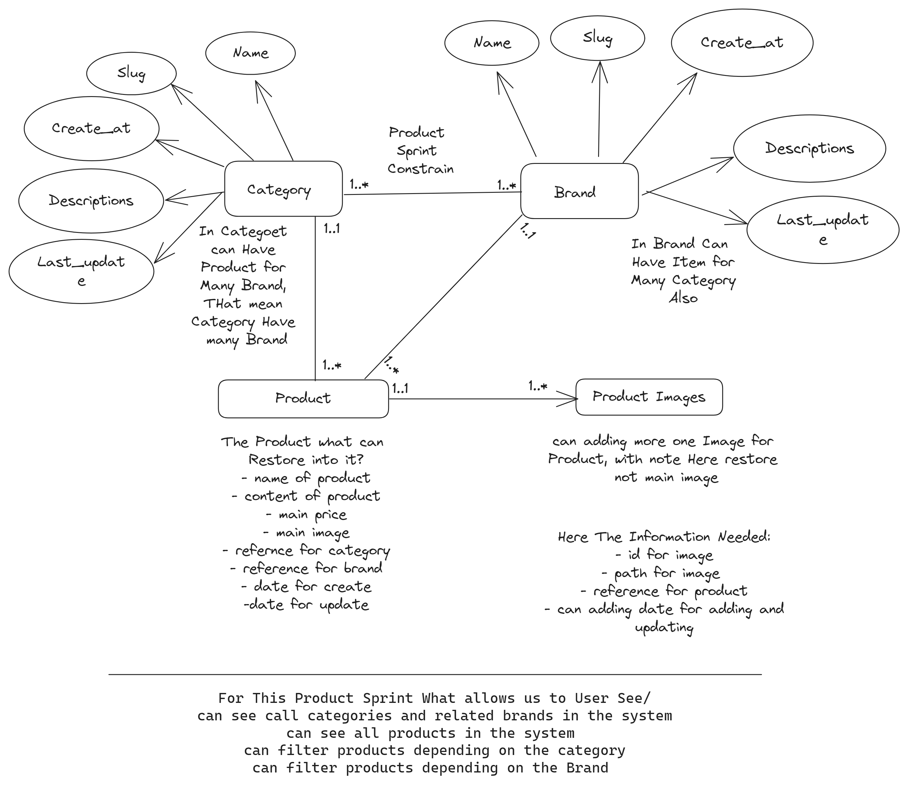

# Django E-commerce API

This project is a Django-based e-commerce API using Django Rest Framework. It includes functionalities for user authentication and product management.

## Authentication Sprint

This sprint includes features for user registration, login using JWT, profile editing, and password changing. Users can register with their name, email, username (derived from email), password, and confirm password. After registration, users can complete their profile with additional details and can change their password through a dedicated view.

### Endpoints:

- `/api/account/register/` - Register a new user.
- `/api/account/login/` - Login and obtain JWT tokens.
- `/api/account/detail/` - Get user profile information.
- `/api/account/edit/` - Edit user profile information.
- `/api/account/change-password/` - Change user password.

## Product Sprint

This sprint includes features for managing categories, brands, and products. Categories and brands are created via the admin panel and are related in a many-to-many relationship. Products can be added with attributes like name, description, price, stock, category, brand, main image, and multiple additional images. Users can view all products and filter them by category or brand.

### Endpoints:

- `/api/categories/` - List all categories.
- `/api/brands/` - List all brands.
- `/api/products/` - List all products and filter by category and brand.

### Product Entity Diagrams and Product Features Explain:



## Setup Instructions

1. **Clone the repository**:

   ```sh
   git clone https://github.com/yourusername/django-ecommerce-api.git
   ```

2. **Navigate to the project directory**:

   ```sh
   cd django-ecommerce-api
   ```

3. **Install the dependencies**:

   ```sh
   pip install -r requirements.txt
   ```

4. **Create the `.env` file**:

   ```sh
   touch .env
   ```

   Add the secert_key, debug, and database settings into the `.env` file:

   ```env
   SECRET_KEY=your_secret_key_here
   DEBUG=your_debug_status
   and database settings here
   ```

5. **Run migrations**:

   ```sh
   python manage.py makemigrations
   python manage.py migrate
   ```

6. **Create a superuser**:

   ```sh
   python manage.py createsuperuser
   ```

7. **Run the development server**:
   ```sh
   python manage.py runserver
   ```

## License

This project is licensed under the MIT License - see the [LICENSE](LICENSE) file for details.
