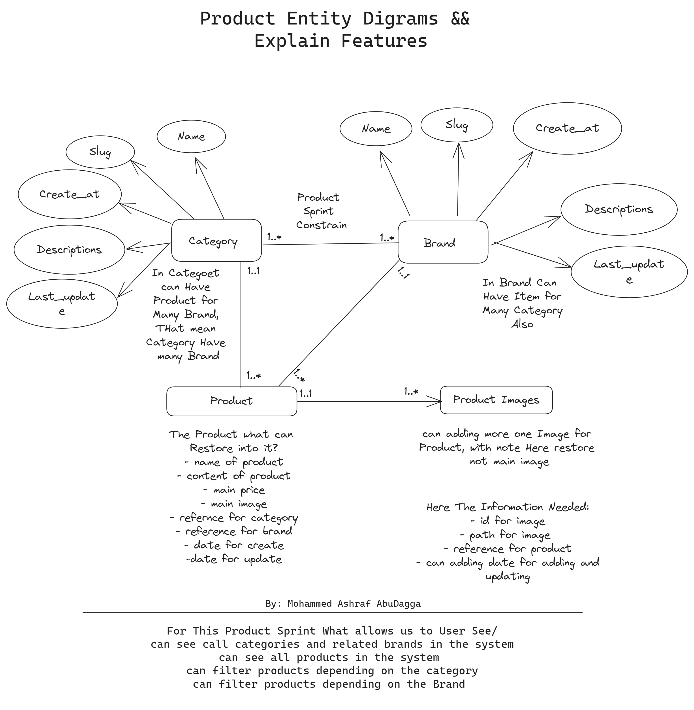

# Django E-commerce API

This project is a Django-based e-commerce API using Django Rest Framework. It includes functionalities for user authentication and product management.

## Authentication Sprint

### Features:

1. **User Registration**:

   - Users can register with their name, email, username (derived from email), password, and confirm password.
   - The registration process includes email validation and password confirmation.

2. **User Login**:

   - Users can log in using their email and password.
   - JWT (JSON Web Tokens) is used for authentication, allowing secure and stateless authentication.

3. **Edit User Information**:

   - After registration, users can complete their profile by adding more details such as date of birth, gender, image, address, and phone number.
   - A dedicated view allows users to update their profile information.

4. **Change Password**:
   - Users can change their password using a dedicated view that requires the old password and the new password.

### Endpoints:

- `/api/auth/register/` - Register a new user.
- `/api/auth/login/` - Login and obtain JWT tokens.
- `/api/auth/login/refresh` - Refresh Access Token and obtain JWT tokens.
- `/api/auth/edit-profile/` - Edit user profile information.
- `/api/auth/change-password/` - Change user password.

## Product Sprint

### Features:

1. **Categories and Brands**:

   - Categories and brands can be created and managed via the admin panel.
   - Each brand can belong to multiple categories and each category can have multiple brands (many-to-many relationship).
   - Categories and brands are slugified for URL-friendly representation.

2. **Products**:

   - Products can be added with attributes such as name, description, price, stock, category, brand, and a main image.
   - Products can have multiple images.

3. **Product Filtering**:
   - Users can view all products and filter them based on category and brand.
   - The product list can be searched by product name and description.

### Endpoints:

- `/api/categories/` - List all categories.
- `/api/brands/` - List all brands.
- `/api/products/` - List all products and filter by category and brand.

### Admin Configuration:

- Slug fields for categories, brands, and products are automatically populated based on their names.
- Products can be managed along with their images directly from the admin panel.

### Image of Product Model:



## Setup Instructions

1. **Clone the repository**:

   ```sh
   git clone https://github.com/yourusername/django-ecommerce-api.git
   ```

2. **Navigate to the project directory**:

   ```sh
   cd django-ecommerce-api
   ```

3. **Install the dependencies**:

   ```sh
   pip install -r requirements.txt
   ```

4. **Run migrations**:

   ```sh
   python manage.py makemigrations
   python manage.py migrate
   ```

5. **Create a superuser**:

   ```sh
   python manage.py createsuperuser
   ```

6. **Run the development server**:
   ```sh
   python manage.py runserver
   ```

## Contributing

We welcome contributions! Please read our [Contributing Guidelines](CONTRIBUTING.md) before submitting a pull request.

## License

This project is licensed under the MIT License - see the [LICENSE](LICENSE) file for details.
